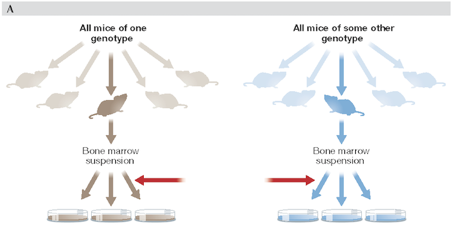
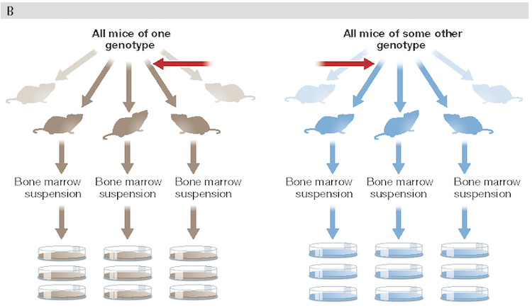
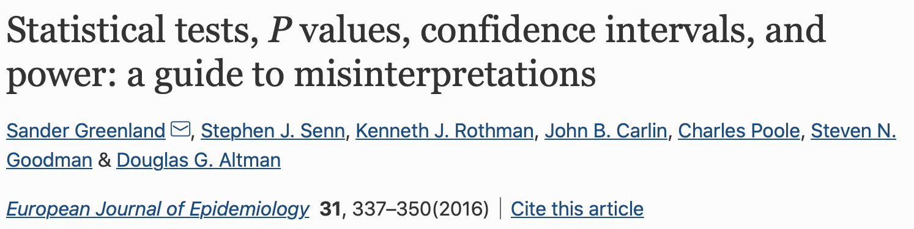
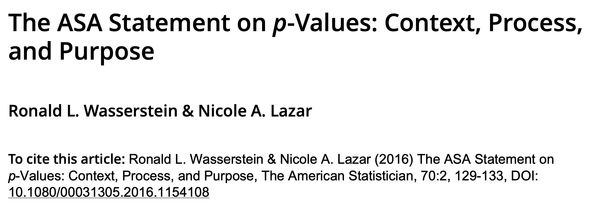
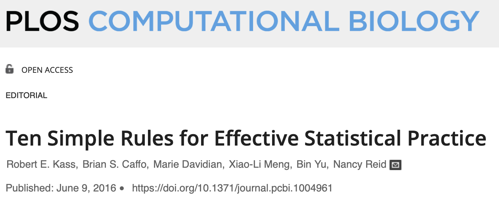
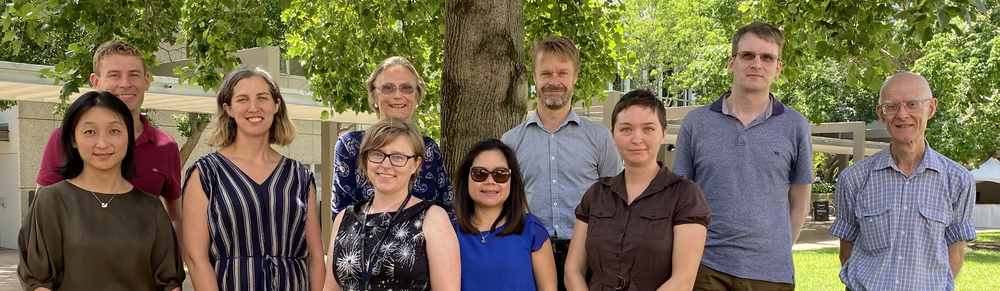

<style type="text/css">
body p {
  color: #000000;

ul { 
  display: block;
  color: #000000;
}

ol { 
  display: block;
  color: #000000;
}

</style>


<style>
div.footnotes {
  position: absolute;
  bottom: 0;
  margin-bottom: 10px;
  width: 80%;
  font-size: 0.6em;
  color: #000000;
}
</style>

<script src="https://ajax.googleapis.com/ajax/libs/jquery/3.1.1/jquery.min.js"></script>

<script>
  $(document).ready(function() {
    $('slide:not(.backdrop):not(.title-slide)').append('<div class=\"footnotes\">');

    $('footnote').each(function(index) {
      var text  = $(this).html();
      var fnNum = (index+1).toString().sup();
      $(this).html(text + fnNum);

      var footnote   = fnNum + ': ' + $(this).attr('content') + '<br/>';
      var oldContent = $(this).parents('slide').children('div.footnotes').html();
      var newContent = oldContent + footnote;
      $(this).parents('slide').children('div.footnotes').html(newContent);
    });
  });
</script>


```{r setup, include = F}

library(knitr)

#knitr::opts_knit$set(root.dir = "../")

knitr::opts_chunk$set(echo = F, warning = F, message = F, 
                      fig.align = "center", 
                      fig.path = "figs/")

##  Need this so tables are formatted nicely
options("kableExtra.html.bsTable" = T)

```


```{r message = F, warning = F}

library(tidyverse)
library(wordcloud)
library(kableExtra)
library(coin)
library(emmeans)

```


```{r}

##  Function for coloured text depending on html or pdf output

##  We can then use the code in an inline R expression:
##    `r colorise("some words in red", "red")`


##  From:
##  https://bookdown.org/yihui/rmarkdown-cookbook/font-color.html

colourise <- function(x, color) {
  if (knitr::is_latex_output()) {
    sprintf("\\textcolor{%s}{%s}", color, x)
  } else if (knitr::is_html_output()) {
    sprintf("<span style='color: %s;'>%s</span>", color, 
      x)
  } else x
}

```


## Statistics important?

Statistics in BABS


```{r echo = F}

words_df <- read.csv("../data/stats_babs.csv", header = F)

wordcloud(words = words_df[ , 1], freq = words_df[ , 2],
          colors = brewer.pal(6, "Dark2"),
          random.color = T,
          scale = c(2, 0.5), rot.per = 1/4)

```


## Outline

- Not a rundown of specific statistical methods
- Some important general principles
- Guidelines for good statistical practice
- Some hopefully useful resources
- A few random questions along the way

<br>

*If you want to ask a question as we go, put your virtual hand up!*


## Trivia question 1

<br>

https://forms.gle/Pyw28ppJuCwtTWL59


## General statistical principles


Let's find a crisis!


How about COVID-19?!

<br>


```{r out.width = "80%", fig.align = "center", fig.cap = "..."}

knitr::include_graphics("../figs/wolkewitz_banner.png")

```


## Some basic principles (Wolkewitz & Puljak 2020)

- Define research questions

  - What standards of care are most effective?
  - What is the effect of adjunct therapies?
  
- Define outcome and explanatory variables 

- Design study using an appropriate study design  
  
- Collect the data you need to answer your research question

- Use standardised protocols to collect and analyse data

- "Statistical expertise is needed to understand potential effects on the complexity of clinical endpoints"

- "Statistical models will play a major role in 'fighting
panic with information' to avoid or at least minimize
the risk of bias"


## General statistical principles

Another crisis flagged in 2005 ... or is there?

<br>

```{r out.width = "80%", fig.align = "center", fig.cap = "..."}

knitr::include_graphics("../figs/ioannidis_banner.png")

```


## General statistical principles

<br>

Is there a *reproducibility* crisis in science?

<br>

https://www.youtube.com/watch?v=j7K3s_vi_1Y&feature=emb_logo


## Irreproducibility


```{r out.width = "80%", fig.align = "center", fig.cap = "..."}

knitr::include_graphics("../figs/baker_research_costs.png")

```


School of BABS Seminar - 20 November, 2020

`r colourise("**Why are so many cell and molecular biology experiments and findings irreproducible?**", "#cc6600")`


## Trivia question 2

<br>

https://forms.gle/6NfUu5x8QaSUXECx6


## Reproducibility - experimental design

- Collect the right data to answer the research question and `r colourise("*enough*", "#8000ff")` of the right data

<br>

How much data do I need to be able to detect the difference I want to detect?

- Power - chance of detecting a true difference (true positive)

- Difference to detect - what size is biologically/clinically important?

- Variability - how variable (noisy) is what I'm studying?

https://vbiostatps.app.vumc.org/ps/


## Reproducibility - experimental design

Power, size of effect, variability, sample size ...


```{r echo = F, eval = F}

##  Exploratory plos

yy1 <- rnorm(n = 10, mean = 7, sd = 1.5)
yy2 <- rnorm(n = 10, mean = 8.5, sd = 1.5)

dd.2t <- data.frame(
  y = c(yy1, yy2), 
  Group = rep(c("A", "B"), each = c(length(yy1), length(yy2)))
  )

ggplot(dd.2t, aes(x = Group, y = y)) +
  geom_boxplot(width = 0.4) +
  geom_jitter(width = 0.1, alpha = 0.9) +
  theme_classic()

```


```{r}

grp_size <- 3:50

diff <- c(2, 4)

stddev <- c(1.5, 3)

params <- expand.grid(diff, stddev)
names(params) <- c("diff", "stddev")

##  Remove last row as effect size 4/3 is same as 2/1.5
params <- params[-4, ]

pwr.calc.out <- list()

for(i in c(1: dim(params)[1])) {
  #
  pwr.calc <- power.t.test(
    n = grp_size, 
    delta = params$diff[i], 
    sd = params$stddev[i])
  #
  pwr.calc.out[[i]] <- data.frame(
    pwr = pwr.calc$power,
    n = grp_size,
    diff = rep(params$diff[i], length(grp_size)),
    sd = rep(params$stddev[i], length(grp_size))
    )
  #
  rm(pwr.calc)

}

pwr.all <- do.call("rbind", pwr.calc.out)


pwr.all$lab <- 
  paste0(
    as.character(pwr.all$diff), " (", as.character(pwr.all$sd), ")")

#head(pwr.all)

names(pwr.all)[5] <- "diff_sd"

pwr.all$diff_sd <-
  factor(pwr.all$diff_sd)


pwr.all %>% 
  ggplot(., aes(x = n, y = pwr, colour = diff_sd)) +
  geom_line(size = 1) +
  labs(x = "Group sample size", y = "Power") +
  ggtitle("Power for difference in means of two independent groups (t-test)") +
  theme_classic()


```


## Sample size = ... - but what is the "replicate"?


```{r out.width = "66%", fig.align = "center", fig.cap = "..."}



```


Technical replication only

- Replicates within each mouse are not independent measurements<footnote content = "Vaux 2012 doi: 10.1038/embor.2012.36"></footnote>


## Sample size = ... - but what is the "replicate"?


```{r out.width = "66%", fig.align = "center", fig.cap = "..."}



```


*Biological* and technical replication<footnote content = "Vaux 2012 doi: 10.1038/embor.2012.36"></footnote>


##  Trivia question 3

<br>

https://forms.gle/9v92pg9vs6toDZeC7


## Sample size = ... - but what is the "replicate"?


- Technical replication is useful to increase the precision of your measurements.

- Biological replication is what counts towards power.

- There is no statistical justification for a sample size of n = 3!


## Power of the test, p-values, publication bias and statistical evidence

<br>

Life as a researcher can have a few surprises!

https://www.youtube.com/watch?v=kMYxd6QeAss

<br>

> - Variance measures variation, which introduces uncertainty into estimates

> - Statistics is the science of learning from data, and of measuring, controlling and communicating uncertainty<footnote content = "Davidian & Louis 2012 doi: 10.1126/science.1218685"></footnote>


## P values - a problem? Who would’ve thought?!

Not another crisis! ... Let's call it an issue instead.


```{r out.width = "66%", fig.align = "center", fig.cap = "..."}



```


```{r out.width = "66%", fig.align = "center", fig.cap = "..."}



```


## P values - a problem? Who would’ve thought?!


"P values, the 'gold standard' of statistical validity, are not as reliable as many scientists assume"<footnote content = "Nuzzo 2014 Nature doi: 10.1038/506150a"></footnote>


"Misinterpretation and abuse of statistical tests, confidence intervals, and statistical power $\ldots$ remain rampant [and] dominate much of the scientific literature"<footnote content = "Greenland et al. 2016 doi: 10.1007/s10654-016-0149-3"></footnote>


"Report P values sparingly."<footnote content = "Michel et al. 2020 doi: 10.1124/dmd.119.090027"></footnote>

<br>

Let's look at P values ...


## P values - What's the idea behind them? 

The FAMuSS study examined the percentage change in strength of the non-dominant arm as a result of exercise in two human genotypes.<footnote content = "Foulkes, A. S., 2009, Applied Statistical Genetics with R: For Population-Based Association Studies, Springer, New York"></footnote>


*Question:* Is there a difference between the two genotypes in the change in mean percentage strength? 


```{r}

##  Load example data

##  From: Foulkes 2009, Applied Statistical Genetics with R, pp. 44-46

load("../data/FAMuSS_Foulkes.RData")

attach(fms)

NamesResistinSnps <- names(fms)[substr(names(fms), 1, 8) == "resistin"]
fmsResistin <- fms[ , is.element(names(fms), NamesResistinSnps)]

library(genetics)

TtestPval <- function(Geno){
  alleleMajor <- allele.names(
    genotype(Geno, sep = "", reorder = "freq"))[1]
  GenoWt <- paste(alleleMajor, alleleMajor, sep = "")
  GenoBin <- as.numeric(Geno != GenoWt)[!is.na(Geno)]
  Trait <- NDRM.CH[!is.na(Geno)]
  return(t.test(Trait[GenoBin == 1], 
                Trait[GenoBin == 0])$p.value)
}

#apply(fmsResistin, 2, TtestPval)

Geno <- fms$"resistin_c180g"
#table(Geno)

GenoWt <- names(table(Geno))[table(Geno) == max(table(Geno))]
#GenoWt

GenoBin <- as.numeric(Geno != GenoWt)[!is.na(Geno)]
Trait <- NDRM.CH[!is.na(Geno)]

#head(Trait)

#t.test(Trait[GenoBin == 1], Trait[GenoBin == 0], var.equal = T)

NDRM.CH.Geno.df <- data.frame(Trait, GenoBin)

NDRM.CH.Geno.df$Genotype <- factor(
  NDRM.CH.Geno.df$GenoBin, 
  labels = c("Homozyg_Wt", "Variant"))


##  Remove NAs from data

NDRM.CH.Geno.df <-
  NDRM.CH.Geno.df %>%
  na.omit()

  
```


A glimpse at the data

- 606 independent measurements of change in percentage strength.


```{r}

NDRM.CH.Geno.df %>%
  select(Trait, Genotype) %>% 
  str()

```

```{r echo = F, eval = F}

t.test(Trait ~ Genotype, data = NDRM.CH.Geno.df, var.equal = T)

mean_diff <- 56.05441 - 50.43503 

mean_diff

```


## P values - What's the idea behind them? 

A picture of the data

```{r out.width = "66%", fig.align = "center", fig.cap = "..."}

ggplot(NDRM.CH.Geno.df, aes(x = Trait, y = Genotype)) +
  geom_boxplot(width = 0.8, colour = "#3366ff", 
               outlier.shape = NA) +
  geom_jitter(height = 0.4, alpha = 0.3) +
  theme_classic() +
  theme(axis.text = element_text(size = 11),
        axis.title = element_text(size = 13))

```
Observed difference in means is 5.62 (%)

## P values - What's the idea behind them? 


<br>

What measure (i.e. statistic) can we use to investigate the difference in percentage strength between the two genotypes?

One possibility: The difference in means (we could use any other sensible statistic - e.g. standardised difference, $t$ statistic, $\ldots$)


## P values - What's the idea behind them?


1.  We assume change (%) in mean strength is the same for both genotypes (Null hypothesis).
2.  Shuffle the two genotype labels on the data values to get many possible arrangements of the order.
3.  Calculate the mean strength change for the two genotypes for each arrangement.
4.  Find the difference between the two genotype means for each arrangement. Do steps 2, 3 and 4 many times.
5.  Look at the pattern of values of all these differences.
6.  See **how unusual** the difference is that we got from our sample data.

This technique makes no assumptions about the distribution of the data.


## P values - What's the idea behind them? {.smaller}


Some examples of the first six genotype values from different shuffled arrangements. Original data order in first column.

<br>

```{r eval = T}

nobs <- dim(NDRM.CH.Geno.df)[1]

gtype <- list()

for(h in 1:4) {
  rand_row <- sample(c(1:nobs), size = nobs, replace = F)
  gtype[[h]] <- as.character(
    NDRM.CH.Geno.df$Genotype[rand_row[1:6]]
    )
  #print(gtype[[h]], quote = F)
}

gtype_all <- data.frame(do.call("cbind", gtype))

##  Add original data order as first column, then rename
gtype_all <- data.frame(
  Original = as.character(NDRM.CH.Geno.df$Genotype[1:6]),
  gtype_all)

names(gtype_all) <- c("Original", "Shuffle_1", "Shuffle_2",
                     "Shuffle_3", "Shuffle_4")
                     
gtype_all %>%
  kbl() %>%
  kable_styling()

```


## P values - What's the idea behind them?


```{r eval = F}

##  Manual permutation test done below

## coin package
i_t <- 
independence_test(Trait ~ Genotype, NDRM.CH.Geno.df,
                  distribution = approximate(nresample = 10000),
                  teststat = "scalar")
                  
```


```{r cache = T, eval = F}

##  To keep results the same, use set.seed

#set.seed(20200914)

nobs <- dim(NDRM.CH.Geno.df)[1]

nsim <- 10000

means_diff <- rep(NA, nsim)

rand_row <- rep(NA, nobs)

rand_row_all <- matrix(NA, nrow = nsim, ncol = nobs)

for(i in c(1:nsim)){
  if(i == 1) {
    rand_row <- sample(c(1:nobs), size = nobs, replace = F)
    rand_row_all[i, ] <- rand_row
    dd1 <- data.frame(
      Trait = NDRM.CH.Geno.df$Trait, 
      Genotype = NDRM.CH.Geno.df$Genotype[rand_row])
  means_obs <- with(dd1, tapply(Trait, INDEX = Genotype, mean))
  means_diff[i] <- means_obs[1] - means_obs[2]
  } else
  { rand_row <- sample(c(1:nobs), size = nobs, replace = F) 
    rand_row_all[i, ] <- rand_row
    ##  Check if rand_row is duplicate of prior row
    dup <- duplicated(rand_row_all[1:i, ])
    if(sum(dup == TRUE) > 0) {
      print(paste(i, "Duplicate"))
      rand_row_all[i, ] <- rep(NA, nobs)
    } else
    { dd1 <- data.frame(
      Trait = NDRM.CH.Geno.df$Trait, 
      Genotype = NDRM.CH.Geno.df$Genotype[rand_row])
    means_obs <- with(dd1, tapply(Trait, INDEX = Genotype, mean))
    means_diff[i] <- means_obs[1] - means_obs[2]
    #rm(rand_row, dd1, means_obs)
  }
  }
}
  
means_obs <- with(NDRM.CH.Geno.df, 
                       tapply(Trait, INDEX = Genotype, mean))

means_diff_obs <- abs(means_obs[1] - means_obs[2])

#range(means_diff)

means_diff <- data.frame(diff = means_diff)

```


```{r eval = F}

##  Save results from simulation as it takes 12 minutes to run!

save(nobs, nsim, rand_row_all, means_obs, means_diff_obs,
     means_diff, file = "../data/sim_out.RData")

```


```{r}

load("../data/sim_out.RData")

```


```{r}

ggplot(means_diff, aes(diff)) +
  geom_histogram(breaks = seq(-12, 12, by = 0.5), 
                 colour = "#888888", fill = "tomato") +
  geom_vline(xintercept = -means_diff_obs, colour = "#660000",
             show.legend = T) +
  geom_vline(xintercept = means_diff_obs, colour = "#660000",
             show.legend = T) +
  labs(x = "Difference in means", y = "Frequency") +
  ggtitle("Diffs in % mean arm strength change between genotypes 
from 10,000 permutations with observed diff. (5.62) (vertical lines)") +
  theme_classic()

```


<br>

## P values - What's the idea behind them?

Observed difference in means is `r round(means_diff_obs, digits = 2)`

<br>


-  How unusual is our sample?

    - What is the proportion of differences out of our 10,000 values that are larger in magnitude than  `r round(means_diff_obs, digits = 2)`?


```{r results = "hide"}

means_diff_prop <-
  means_diff %>%
  summarise(n_tails = sum(abs(means_diff$diff) >= abs(means_diff_obs)),
            proportion  = n_tails / nsim) #%>%
  #kable() %>%
  #kable_styling(full_width = F) 

means_diff_prop

```

- There are `r means_diff_prop$n_tails` difference values that are at least as large in magnitude as the difference in our sample.

- The proportion of these differences out of 10,000 is `r round(means_diff_prop$proportion, digits = 3)`

- This proportion tells us *how unusual* our sample is, *assuming* the null hypothesis of equal group means is true.


## P values - What's the idea behind them?


```{r results = "hide"}

##  Do "lm" and check assumptions

gen.lm <- lm(Trait ~ Genotype, data = NDRM.CH.Geno.df)

summary(gen.lm)

```


```{r fig.show = "hide"}

par(mfrow = c(1, 2))
plot(rstandard(gen.lm) ~ fitted(gen.lm))
abline(h = 0, col = "red")
plot(gen.lm, which = 2)
par(mfrow = c(1, 1))

```


```{r results = "hide"}

wilcox.test(Trait ~ Genotype, data = NDRM.CH.Geno.df)

```


```{r}

tt0 <- t.test(Trait ~ Genotype, NDRM.CH.Geno.df, var.equal = T)

```


- `r colourise("P value is an indication of *how unusual* a sample is, assuming the null hypothesis that the two groups have the same mean is true.", "#8000ff")`

- Proportion from permutation test is our P value for that test: 

  - $p =$ `r round(means_diff_prop$proportion, digits = 3)`


- $t$ test (two independent samples) of the null hypothesis of equal means (and check the assumptions for the test!!!):

  - $p =$ `r round(tt0$p.value, digits = 3)`


## P values - What does a P value mean? 


`r colourise("The P value is the probability of getting the data we got, *assuming the null hypothesis of equal means is true*.", "#8000ff")`

- It tells us how consistent with the null hypothesis our sample data is.

- A P value should be interpreted on a *continuum*, not whether p < 0.05 or p > 0.05

- A P value:

  -  is **not** the probability that the null hypothesis is true
  -  is **not** the probability that the results were due to chance


 
## Reporting results 

Assuming

- you have chosen an appropriate statistical test and
- the assumptions of the test are satisfied ...

you still have to *judge* whether your results are *biologically or clinically meaningful*

- P values do *not* tell the whole story - they say nothing about the size of an effect or how strong an association is<footnote content = "Harrington 2019, New England Journal of Medicine, doi: 10.1056/NEJMe1906559"></footnote>

- A small P value is **not** evidence of an important finding - a small P value does not guarantee scientific or clinical importance

- Report *both* the size of the effect and the P value!


## Trivia question 4

```{r eval = F}

## Plot for this question

gen.emm <- emmeans(gen.lm, ~ Genotype)

genotype_means <- 
plot(gen.emm, horizontal = F) +
  labs(x = "Mean percent. change in strength") +
  theme_classic() +
    theme(axis.text = element_text(size = 11),
        axis.title = element_text(size = 13))

ggsave("../figs/genotype_means.png", width = 5, height = 4)

```


<br>

https://forms.gle/jfpaMggJcvxvwbFo7


## Where does statistics fit into research?


To consult the statistician after an experiment is finished is often merely to ask [them] to conduct a post mortem examination. [They] can perhaps say what the experiment died of.<footnote content = "Fisher R, 1938. Sankhya 4: 14-17"></footnote>

<br>

```{r out.width = "80%", fig.align = "center", fig.cap = "..."}



```


## Life as a new researcher

- Keep a good work-life balance - have a life outside study to stay sane!

- Make a research project plan early
    - plan your statistical analysis at the start, not the end!
    
- Find other people doing similar research - socialise with your lab group and other colleagues

- Ask for help when you need it - asking for help can be a strength not a weakness - don't struggle on your own!

- Things will not always go to plan - think about possible alternative statistical analyses in your initial planning

- Think positive and have a good time!<footnote content = "Taylor 2018, Twenty things I wish I'd known ..., Nature, doi: 10.1038/d41586-018-07332-x"></footnote>


##  Stats Central

[Who are we?](https://www.analytical.unsw.edu.au/facilities/stats-central)


Stats Central is a statistical consulting unit established at UNSW in 2016 to provide university-wide support for staff and HDR students during study design and analysis. 


```{r out.width = "80%", fig.align = "center", fig.cap = "..."}



```


## Resources - Guidelines {.smaller}


- Kass et al. 2016, Ten simple rules for effective statistical practice <https://doi.org/10.1371/journal.pcbi.1004961>
- Pollard 2019, Empowering statistical methods for cellular and molecular biologists <https://doi.org/10.1091/mbc.E15-02-0076>
- Vaux 2014, Basic statistics in cell biology. <https://doi.org/10.1146/annurev-cellbio-100913-013303>
- Vaux 2012, Repeats and replicates .... <https://doi.org/10.1038/embor.2012.36>
- Lord 2020, SuperPlots: communicating reproducibility and variability in cell biology. <https://doi.org/10.1083/jcb.202001064>

<br>

- Holmes and Huber 2019, _Modern Statistics for Modern Biology_ <http://web.stanford.edu/class/bios221/book/introduction.html>

 
## Resources - Guidelines continued {.smaller}

- Michel, M. C. et al., 2020, New author guidelines for displaying data and reporting data analysis and statistical methods in experimental biology. <https://doi.org/10.1124/dmd.119.090027>
- Lang 2016, Never P alone <https://journal.emwa.org/statistics/never-p-alone-the-value-of-estimates-and-confidence-intervals/>
- Lang and Altman 2016, Statistical analyses and methods in the published literature: the SAMPL guidelines <https://journal.emwa.org/statistics/statistical-analyses-and-methods-in-the-published-literature-the-sampl-guidelines/>
- Harrington, D. et al., 2019, New guidelines for statistical reporting in the Journal (New England Journal of Medicine) <https://doi.org/10.1056/NEJMe1906559>

<br>

- Greenland et al. 2016, Statistical tests, P values, confidence intervals, and power: a guide to misinterpretations <https://doi.org/10.1007/s10654-016-0149-3>
- Wasserstein et al. 2019, Moving to a world beyond "p < 0.05" <https://doi.org/10.1080/00031305.2019.1583913>
 
 

## Resources - Guidelines continued {.smaller}


  - Naegle 2015, Criteria for biological reproducibility: what does "n" mean? <https://doi.org/10.1126/scisignal.aab1125>
  - Nuzzo 2018, Tips for communicating statistical significance <https://www.nih.gov/about-nih/what-we-do/science-health-public-trust/perspectives/science-health-public-trust/tips-communicating-statistical-significance>
  
 <br>
 
- Taylor, L. A.,  2018, Twenty things I wish I’d known when I started my PhD, *Nature*, <https://doi.org/10.1038/d41586-018-07332-x>
 
## Resources - Guidelines continued {.smaller}

Free R courses

- Keep an eye out here - UNSW Research Technology Services - these courses fill up very quickly:
<https://research.unsw.edu.au/research-technology-training>
- On the ResTech web page above, click "R" under "Other Courses" for some other R courses. The "Learning R" course from LinkedIn Learning is free for UNSW students.
- <https://www.edx.org> (e.g. Data Analysis for the Life Sciences, Statistics and R, Bioinformatics, Introduction to Bioconductor, Statistical Inference and Modeling for High-throughput Experiments, ... - look for courses by Rafael Irizarry, who is very well regarded) 


