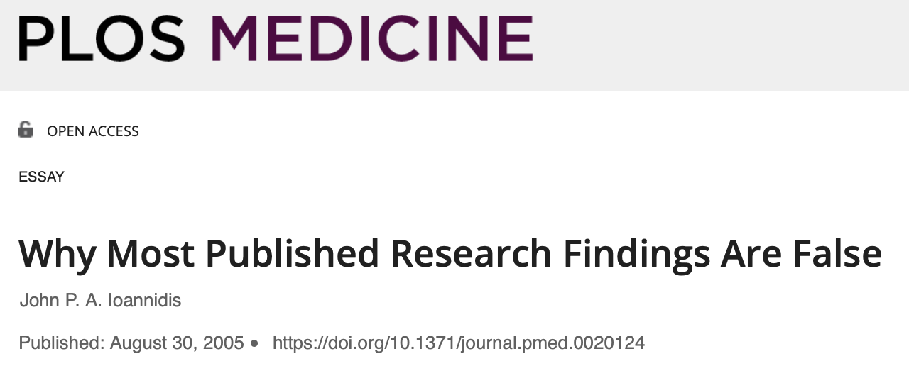
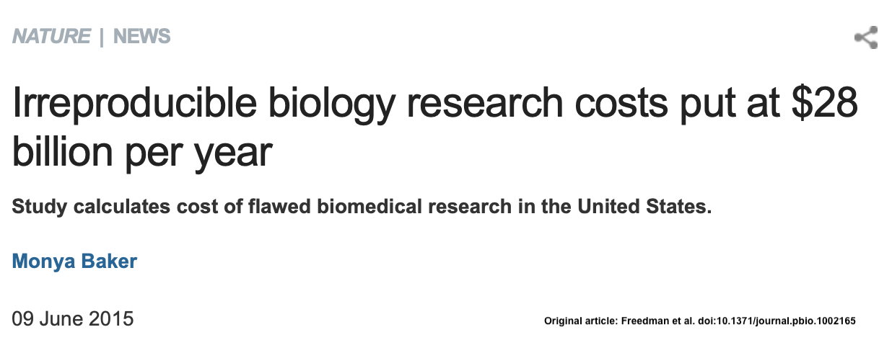

<style type="text/css">
body p {
  color: #000000;

ul { 
  display: block;
  color: #000000;
}

ol { 
  display: block;
  color: #000000;
}

</style>


<style>
div.footnotes {
  position: absolute;
  bottom: 0;
  margin-bottom: 10px;
  width: 80%;
  font-size: 0.6em;
  color: #000000;
}
</style>

<script src="https://ajax.googleapis.com/ajax/libs/jquery/3.1.1/jquery.min.js"></script>

<script>
  $(document).ready(function() {
    $('slide:not(.backdrop):not(.title-slide)').append('<div class=\"footnotes\">');

    $('footnote').each(function(index) {
      var text  = $(this).html();
      var fnNum = (index+1).toString().sup();
      $(this).html(text + fnNum);

      var footnote   = fnNum + ': ' + $(this).attr('content') + '<br/>';
      var oldContent = $(this).parents('slide').children('div.footnotes').html();
      var newContent = oldContent + footnote;
      $(this).parents('slide').children('div.footnotes').html(newContent);
    });
  });
</script>


```{r setup, include = F}

library(knitr)

#knitr::opts_knit$set(root.dir = "../")

knitr::opts_chunk$set(echo = F, warning = F, message = F, 
                      fig.align = "center", 
                      fig.path = "figs/")

##  Need this so tables are formatted nicely
options("kableExtra.html.bsTable" = T)

```


```{r}

library(wordcloud)

```


```{r}

##  Function for coloured text depending on html or pdf output

##  We can then use the code in an inline R expression:
##    `r colorise("some words in red", "red")`


##  From:
##  https://bookdown.org/yihui/rmarkdown-cookbook/font-color.html

colourise <- function(x, color) {
  if (knitr::is_latex_output()) {
    sprintf("\\textcolor{%s}{%s}", color, x)
  } else if (knitr::is_html_output()) {
    sprintf("<span style='color: %s;'>%s</span>", color, 
      x)
  } else x
}

```


## Statistics important?

Statistics in BABS


```{r echo = F}

words_df <- read.csv("../data/stats_babs.csv", header = F)

wordcloud(words = words_df[ , 1], freq = words_df[ , 2],
          colors = brewer.pal(6, "Dark2"),
          random.color = T,
          scale = c(2, 0.5), rot.per = 1/4)

```


## Outline

- Not a rundown of specific statistical methods
- Some important general principles
- Guidelines for good statistical practice
- Some hopefully useful resources
- A few random questions along the way

<br>

*If you want to ask a question as we go, put your virtual hand up!*


## Trivia question 1

<br>

https://forms.gle/Pyw28ppJuCwtTWL59


## General statistical principles


Let's find a crisis!


How about COVID-19?!

<br>


```{r out.width = "100%", fig.align = "center", fig.cap = "..."}


```


## Some basic principles (Wolkewitz & Puljak 2020)

- Define research questions

  - What standards of care are most effective?
  - What is the effect of adjunct therapies?
  
- Define outcome and explanatory variables 

- Design study using an appropriate study design  
  
- Collect the data you need to answer your research question

- Use standardised protocols to collect and analyse data

- "Statistical expertise is needed to understand potential effects on the complexity of clinical endpoints"

- "Statistical models will play a major role in 'fighting
panic with information' to avoid or at least minimize
the risk of bias"


## General statistical principles

Another crisis flagged in 2005 ... or is there?

<br>

```{r out.width = "100%", fig.align = "center", fig.cap = "..."}



```


## General statistical principles

<br>

Is there a *reproducibility* crisis in science?

<br>

https://www.youtube.com/watch?v=j7K3s_vi_1Y&feature=emb_logo


## Irreproducibility

School of BABS Seminar - 20 November, 2020

`r colourise("**Why are so many cell and molecular biology experiments and findings irreproducible?**", "#cc6600")`

<br>

```{r out.width = "100%", fig.align = "center", fig.cap = "..."}



```


## Trivia question 2

<br>

https://forms.gle/6NfUu5x8QaSUXECx6


## Reproducibility - experimental design

- Collect the right data to answer the research question and `r colourise("*enough*", "#8000ff")` of the right data

<br>

How much data do I need to be able to detect the difference I want to detect?

- Power - chance of detecting a true difference (true positive)

- Difference to detect - what size is biologically/clinically important?

- Variability - how variable (noisy) is what I'm studying?


********

##  Tentative slides


##  Irreproducibility

Some of the causes:

- noisy biological systems
- poor experimental design
- unknown and ignored variables (e.g. batch effects)
- unconscious bias
- poor documentation

